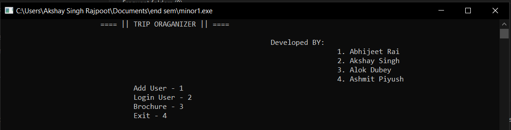
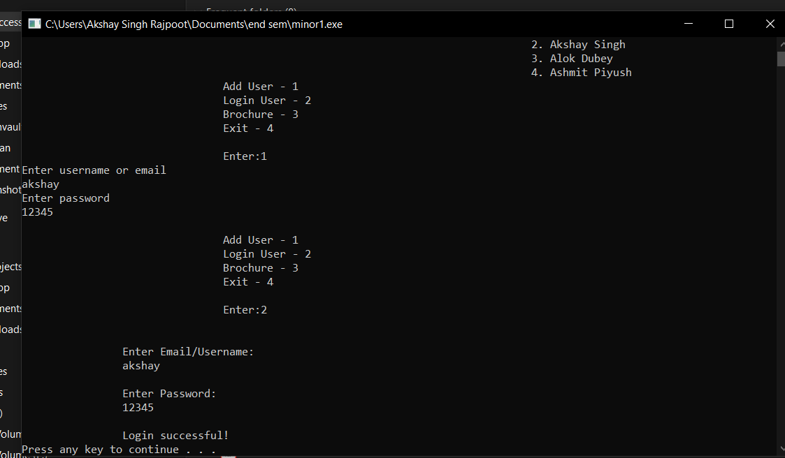
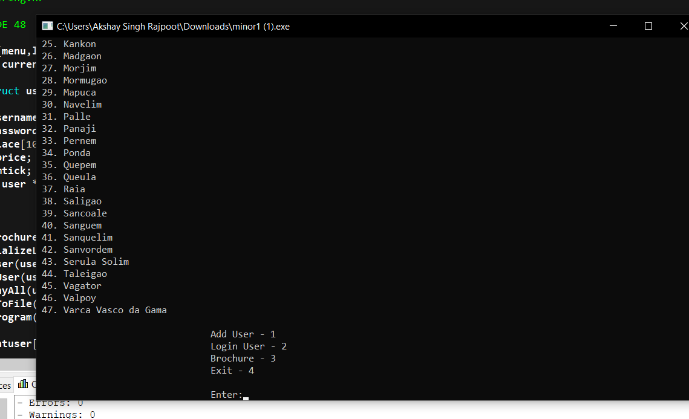
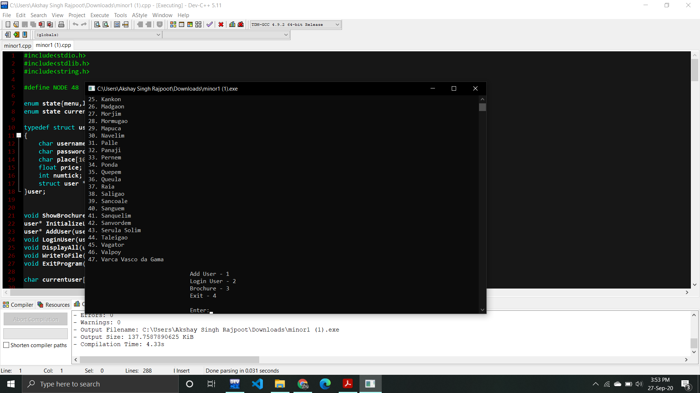

# TripOrganizer

The project aims to solve the problem of organizing the trip of the user. It provides the
optimal path from the source location to the destination using Floyd- Warshall Algorithm
Algorithm covering all the famous places near it which are recommended for the user to visit.

 

 

 

